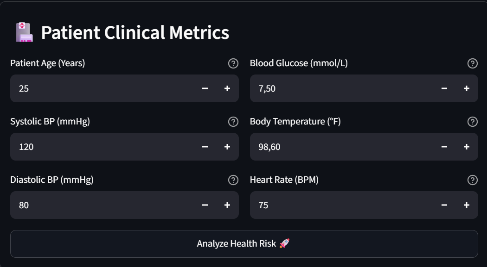
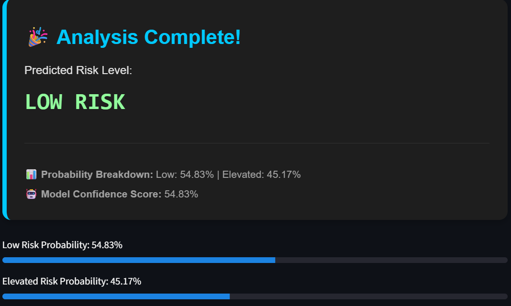
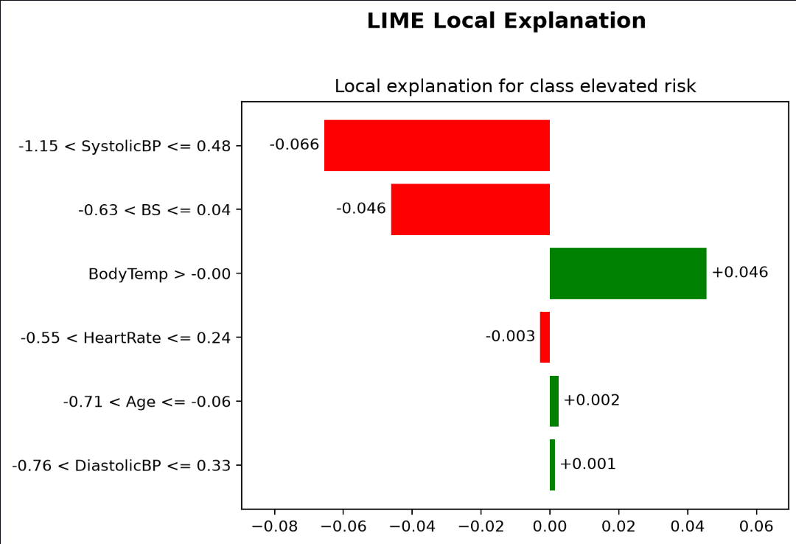
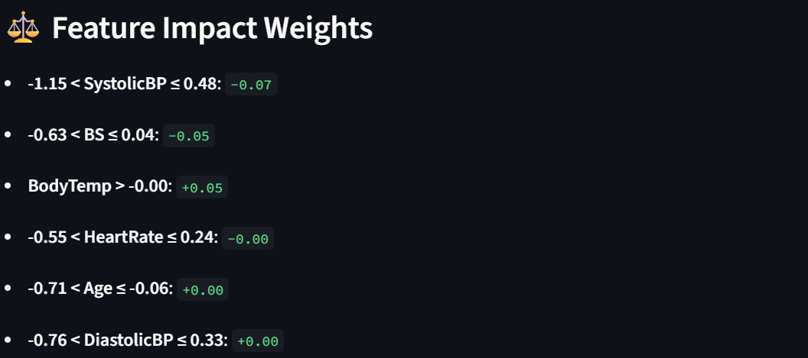
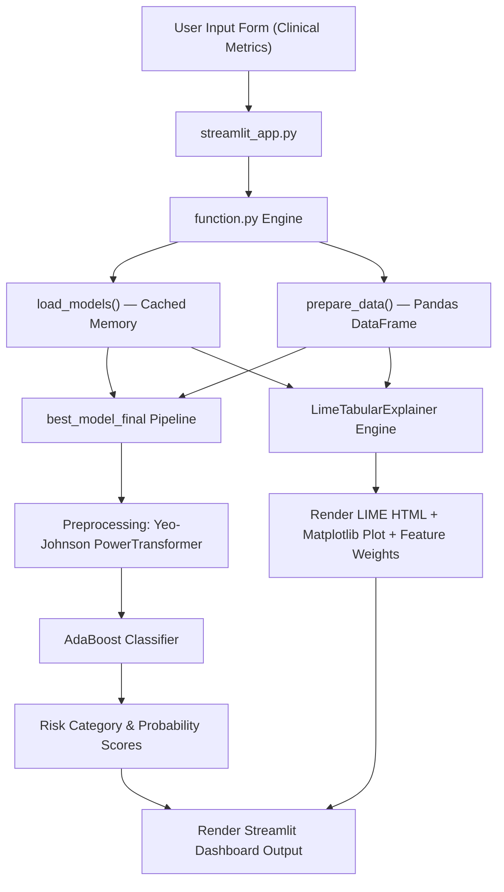

# 🩺 Maternal Health Risk Predictor — Interactive Streamlit App with LIME Explainability


## 📌 Overview

This repository contains an interactive **Streamlit** dashboard that predicts a patient's maternal health risk category directly from six clinical vital signs, and immediately explains *why* the model made that prediction using **LIME (Local Interpretable Model-agnostic Explanations)**. It's built as a single-patient clinical risk-triage tool — a clinician fills in one patient's vitals and gets back both a risk label and the reasoning behind it in the same screen.

The application runs as a **single, self-contained, in-process pipeline**: the Streamlit frontend (`streamlit_app.py`) calls directly into a backend logic module (`function.py`), which loads a pre-trained model pipeline and a cached LIME background dataset into memory, then performs preprocessing, inference, and explanation generation locally — with no external API calls involved.

The system ingests six patient vitals — **Age, Systolic Blood Pressure, Diastolic Blood Pressure, Blood Glucose (BS), Body Temperature, and Heart Rate** — and classifies the patient into one of two clinical risk tiers: **Low Risk** or **Elevated Risk**. Every prediction is paired with a transparent, feature-level explanation so the reasoning behind the model's output is never a black box.

### ✨ Key Features
* 📝 **Guided input form** with physiologically sensible min/max ranges enforced per field, so a submission is never wildly out of bounds.
* ⚡ **Instant risk classification** (Low Risk / Elevated Risk) with a model confidence score shown right after submission.
* 📊 **Probability breakdown** for both classes, visualized as progress bars alongside the raw percentages.
* 🧠 **Local explainability on demand** — every prediction is followed by a LIME explanation rendered as an interactive HTML plot, a static Matplotlib chart, and a plain-text list of feature impact weights.
* 🛡️ **Structured error handling** — failures during data preparation, prediction, or explanation are caught and routed into clear, categorized error messages (data error, model error, system error) instead of a raw crash.

---

## 🎯 Context & Problem Statement

Before designing the app, it's worth being explicit about what it's actually solving — not just what it does, but why it needs to exist in the first place.

### 🏥 The Problem
A maternal risk-triage tool only makes sense if it's solving something a clinician actually struggles with day to day. Looking at how risk assessment typically breaks down in practice, two concrete problems stand out and are what this app is built around:
1. **Delayed risk detection.** In resource-constrained clinical settings, subtle physiological warning signs (blood pressure, blood sugar, heart rate, etc.) are often missed until a complication becomes acute, simply because there is no fast way to turn routine vitals into a risk signal.
2. **Lack of trust in ML predictions.** Even when a model exists, medical professionals are reluctant to act on a prediction they cannot interpret — a plain "Elevated Risk" label with no reasoning behind it is not clinically actionable on its own.

### 💡 The Solution
Rather than treating these as separate concerns, the app is designed so each part of the workflow answers one of the two problems above directly, instead of just producing a label and calling it done:
* 🩺 **For delayed detection** — the form takes the six vitals a clinician would already be measuring and returns an instant Low Risk / Elevated Risk classification with a confidence score, so risk triage happens in seconds instead of waiting for a complication to appear.
* 🧠 **For lack of trust** — every prediction is immediately followed by a **LIME explanation** showing exactly which vitals pushed the result toward or away from Elevated Risk, so the output is a reasoned assessment rather than an opaque label.

---

## 📊 Quantitative Metrics

The model powering this app is an **AdaBoost Classifier** (wrapped in a preprocessing pipeline) trained on the **UCI Maternal Health Risk Dataset**, predicting a binary risk label — `low risk` vs. `elevated risk`.

### 🏁 Held-Out Test Set Evaluation

| Performance Metric | Evaluation Score |
| :--- | :--- |
| **Accuracy** | **76.67%** |
| **Macro Precision** | **77.78%** |
| **Macro Recall** | **76.18%** |
| **Macro F1-Score** | **76.17%** |
| **Log Loss** | **0.5842** |

*The full data preparation, model benchmarking, and hyperparameter tuning process behind this model is maintained in a separate training/notebook repository, not in this repo — this repository only covers the Streamlit application that consumes the exported model.*

---

## 📷 Screenshots & Demo

### 1. Interactive Assessment Interface

*Clinical parameter entry form with enforced physiological range boundaries for each vital sign.*

### 2. Risk Prediction Output

*Risk classification result showing the predicted category, model confidence score, and probability breakdown between Low Risk and Elevated Risk.*

### 3. Local Explainability (LIME XAI Plot)

*LIME bar chart showing which specific clinical metrics push the probability toward or away from Elevated Risk (label 1), regardless of the actual prediction.*

### 4. Feature Impact Weights

*Plain-text breakdown of each feature's weight toward the Elevated Risk class, listed right below the LIME chart in the app.*

### 🔗 Live Demo
Try the deployed application here: **[maternal-health-risk-2-target-lime.streamlit.app](https://maternal-health-risk-2-target-lime.streamlit.app/)**

---

## ⚙️ Architecture & Data Flow

### 🏗️ Engineering Overview
The application follows a **monolithic, in-process pattern**: `streamlit_app.py` handles the UI/form layer, while `function.py` owns all backend logic (model loading, preprocessing, inference, and LIME explanation). Heavy artifacts (`best_model_final.joblib`, `lime_training_data.npy`) are loaded once at startup using Streamlit's `@st.cache_resource` decorator, avoiding redundant disk reads on every user interaction. Both prediction and explanation run entirely in memory — there is no network round-trip involved.

> **Note:** the LIME explanation is always generated with respect to the **`elevated risk` class (label 1)**, regardless of which class the model actually predicts. This means the chart and feature weights always describe which vitals push the probability *toward or away from Elevated Risk*, even on a submission the model classifies as Low Risk.

### 🔄 End-to-End System Flowchart



---

## 💻 Installation & Reproduction Steps

### 📋 Prerequisites
* **Python**: `3.10+`
* **Package Manager**: `pip`

### 🛠️ CLI Installation & Execution

#### 1. Clone the Repository
```bash
git clone https://github.com/viochris/maternal_health_risk_streamlit_2_target_lime.git
cd maternal_health_risk_streamlit_2_target_lime
```

#### 2. Create and Activate Virtual Environment
```bash
# macOS/Linux
python3 -m venv venv
source venv/bin/activate

# Windows
python -m venv venv
venv\Scripts\activate
```

#### 3. Install Dependencies
```bash
pip install --upgrade pip
pip install -r requirements.txt
```

#### 4. Run the Application
```bash
streamlit run streamlit_app.py
```

---

## ⚠️ System Limitations

### 🏗️ Architectural Limitations
* **Single-Instance Processing (N=1):** The application processes one patient's form input at a time; batch prediction via CSV upload is currently unsupported.
* **Sequential Prediction & Explanation Calls:** Generating a LIME explanation requires re-preparing the input data and running a separate `explain()` step after `predict()`, adding a small amount of extra local computation per submission.

### 🔬 Model & Domain Limitations
* **Reduced Label Granularity:** Collapsing `mid risk` and `high risk` into a single `elevated risk` class simplifies the original 3-class problem, which means the app cannot distinguish moderately elevated risk from severely high risk.
* **Elevated Risk Recall:** The Elevated Risk class shows lower recall relative to precision on the test set, meaning some genuinely elevated-risk patients may be classified as low risk — an important caveat for any real clinical use.
* **Demographic Generalizability:** The model is trained on 446 patient instances collected via the UCI Maternal Health Risk Dataset; performance may vary when applied to broader or different population cohorts.
* **Security Constraints:** Built as a technical/portfolio demonstration, the system lacks embedded rate-limiting, user authentication, and access logging.

---

## 🚀 Future Work
* **Batch Prediction Support:** Allow CSV upload so multiple patients can be assessed in one pass instead of one form submission at a time.
* **Restore 3-Class Granularity:** Offer an option to view the original `low risk` / `mid risk` / `high risk` split instead of only the collapsed binary label, for settings that need finer triage.
* **Shared Preprocessing Step:** Cache the preprocessed features between `predict()` and `explain()` so a single submission doesn't run data preparation twice.
* **Basic Access Controls:** Add lightweight authentication and request logging before considering any real clinical deployment beyond a portfolio demo.

---

## 📄 License
This project is licensed under the **MIT License** — see the [LICENSE](LICENSE) file for details.

---
**Author:** [Silvio Christian Joe](https://github.com/viochris)

*"Making a maternal health risk prediction transparent — one local explanation at a time."*
